# Aplikacja Okienkowa - Virtual Merchant

# Wstęp 
Aplikacja została napisana z użyciem języka Java i we współpracy z Peter022000 (Piotr Duda) w ramach projektu na studia.

# Udział
Design, całość frontendu oraz logika logowania i rejestracji została wykonana przeze mnie. Większość backendu oraz logika zarządzania sklepem wykonana została przez Peter022000.

# Opis projektu
Głównym celem projektu było stworzenie wirtualnego sklepu dla gry Dungeons and Dragons 5e, który umożliwi użytkownikom kupowanie wirtualnych towarów w różnych wybranych sklepach. Użytkownicy mogą przeglądać swój ekwipunek oraz zakupione przedmioty, ich cene, właściwości i opis.
Użytkownikowi kupują przedmioty w sklepach za pomocą wirtualnych środków - waluty z gry DnD (złoto, srebro, itd.). 

Wszystkie funkcjonalności dostępne są po założeniu konta i zalogowaniu się do systemu. Oprócz tego specjalne konto (właściciel wirtualnego rynku) może zarządzać asortymentem 
poszczególnych sklepów i ewentualnie, gdy zajdzie taka potrzeba, dodawać niestandardowe przedmioty do sklepu. System ma na celu symulację rynku lub pojedynczych sklepów i ułatwienie ich użycia, gdy zajdzie taka potrzeba 
podczas tzw. „Gry fabularnej”. Wszystko to będzie się odbywać za pośrednictwem internetu.

***

# Ekrany aplikacji

### Logowanie
<kbd>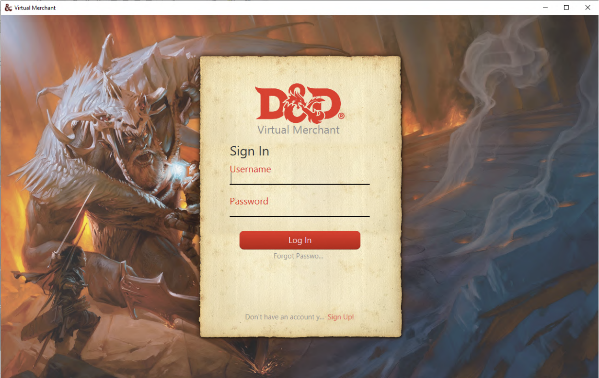</kbd>
***

### Rejestracja
<kbd>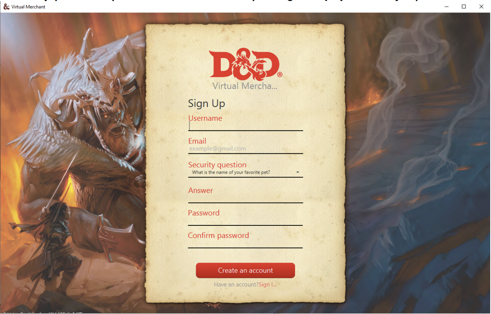</kbd>
***

### Menu
<kbd>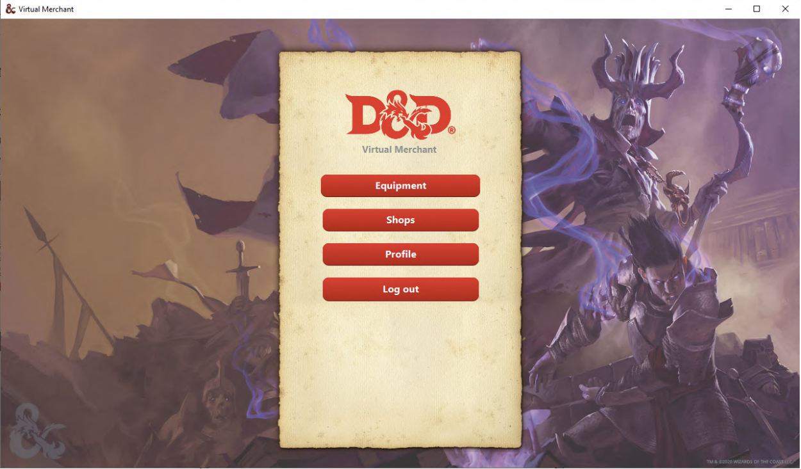</kbd>
***

### Profil
<kbd>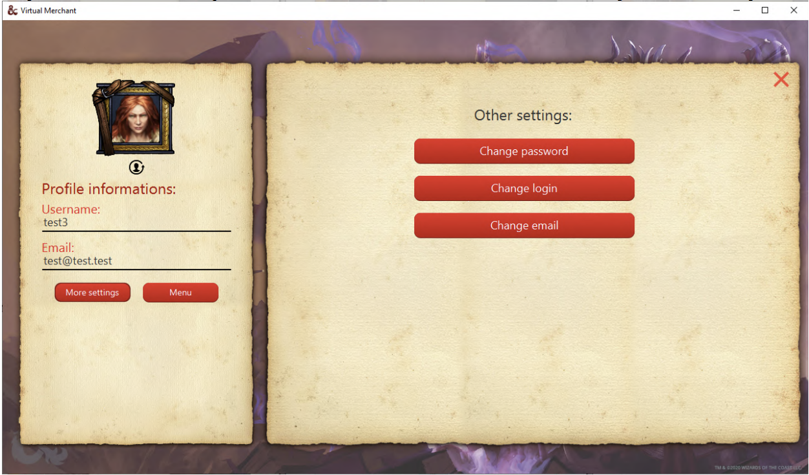</kbd>
***

### Zmiana avataru
<kbd>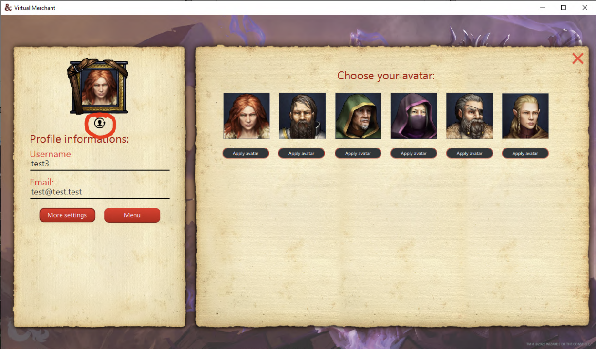</kbd>
***

### Ekwipunek
<kbd>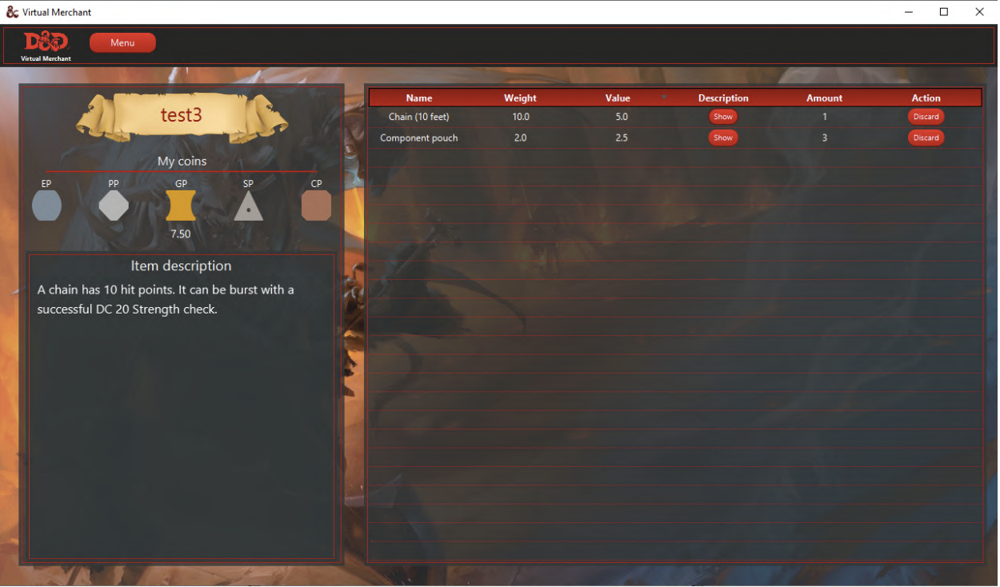</kbd>
***

### Sklep
<kbd>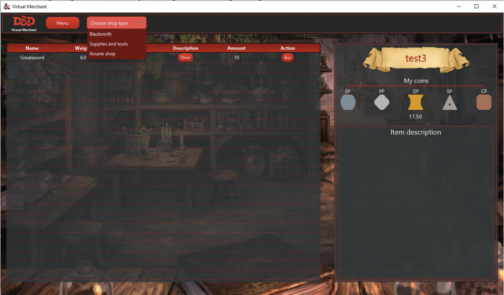</kbd>
***

# Diagramy ERD
<table>
  <tr>
    <td><kbd>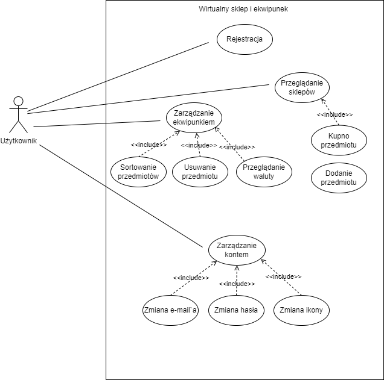</kbd></td>
    <td><kbd>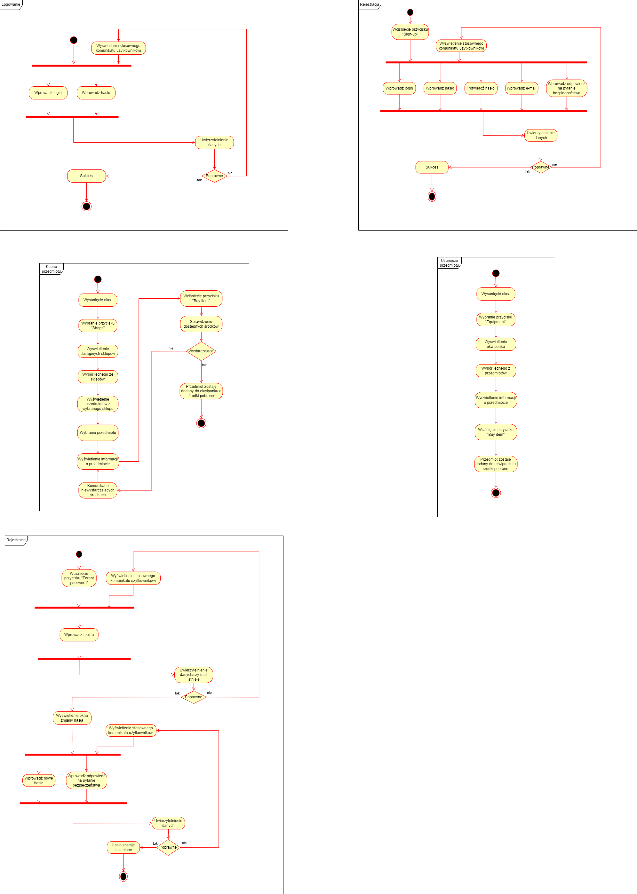</kbd></td>
    <td><kbd>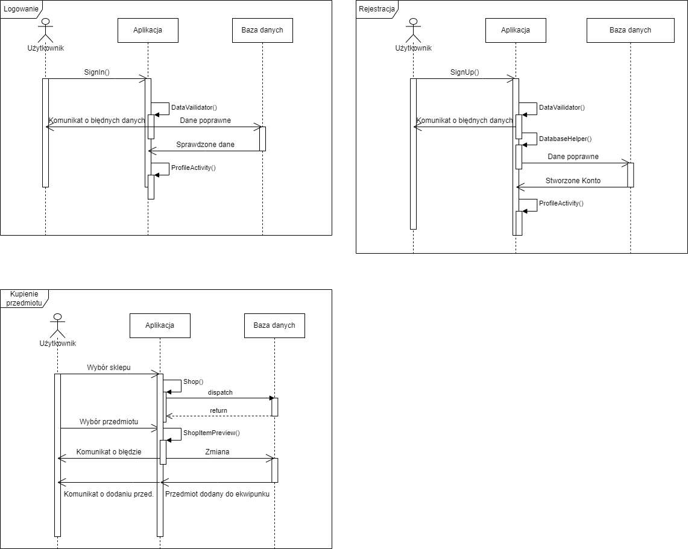</kbd></td>
    <td><kbd>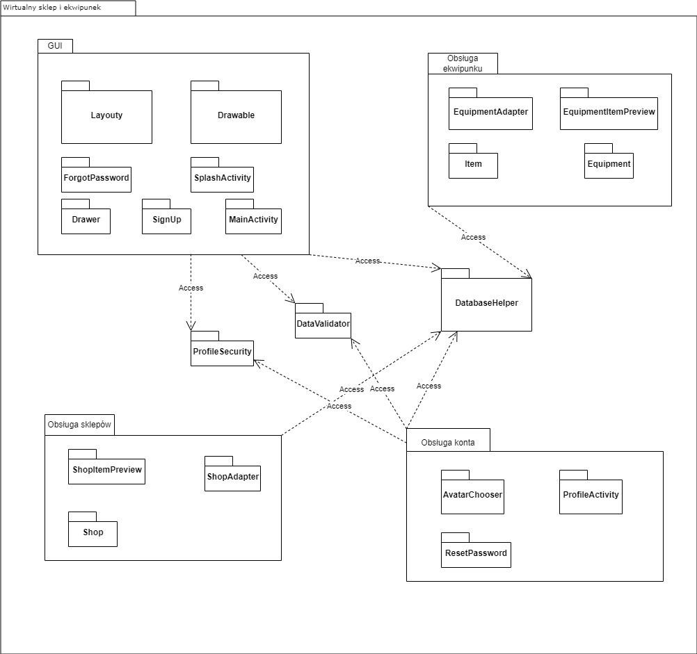</kbd></td>
  </tr>
</table>

# Dokumentacja projektu
[Dokumentacja.pdf](./resources/Dokumentacja%końcowa.pdf)

# Technologie użyte w projekcie
- java
- maven
- postgresql

# Autorzy
Marcin Król, Piotr Duda
